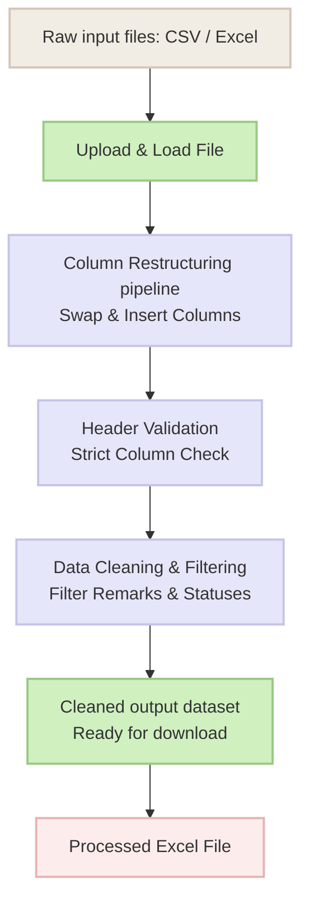

# ▚ XDAYS SL EXPORT DIRECT AUTOMATION

**Live app:** [xdays-sl-export-direct.streamlit.app](https://xdays-sl-export-direct.streamlit.app/)

Eric Jerard Collantes | Modified July 31

> [!NOTE]
> **Project:** Automated data cleaning and column restructuring for XDAYS SL DRR Export.
> **Developer:** SP MADRID
> **Started:** July 2026
> **Last Updated:** July 31, 2026

---

## Overview of Automation

> [!IMPORTANT]
> The **XDAYS SL Export Direct** is a centralized tool designed to automate the cleaning and processing of raw export files for collection agents. This system significantly reduces human error and processing time by replacing manual column restructuring, header validation, and data filtering with a one-click automated Python pipeline.
> 
> **LINK:** [XDAYS SL Export Direct (Streamlit)](https://xdays-sl-export-direct.streamlit.app/)

---

## Summarized Process

1. **Upload the raw file:** Upload Raw Export File (`.csv`, `.xls`, or `.xlsx`).
2. **Transform and Clean the data through an automated pipeline:**
   - **RESTRUCTURE:** 
     - Swap `Next Call` and `PTP Date` columns.
     - Copy `Old IC` column and insert it beside the `Contact Type` column.
     - Copy `Call Duration` column and insert it between the `Area` and `Black Case No.` columns.
   - **VALIDATE:** Check the newly arranged columns against a strict expected list of headers to prevent data corruption.
   - **FILTER:** 
     - *Remark Filter*: Exclude rows where the remark starts with "new assignment", "new contact", or "system auto update".
     - *Status Filter*: Exclude rows with blank statuses or statuses matching "abort", "locked", "new", "sms sent", etc.
3. **Generate Processed File** using the *cleaned output DataFrame*.
   - *Output as an Excel file ready for download.*

---

## Flowchart of Whole Automation

---

## Improvements to Current Workflow

> [!TIP]
> **IMP-001: Faster and More Reliable Cleaning Pipeline**

| 😞 BEFORE | 😃 AFTER |
| :--- | :--- |
| • Manual column swapping and restructuring. • No strict header validation, making it prone to downstream errors. • Manual, tedious filtering of Remarks and Status columns using Excel filters. | • **Automation handles** column restructuring perfectly and instantly every time. • **Strict header validation** catches structural issues immediately before processing. • **Automated filtering** for Remarks and Statuses removes unnecessary data accurately. |

---

## Technology Stack

> [!NOTE]
> The automation was built using modern, open-source technologies to ensure speed, stability, and future scalability:

- **Frontend / UI:** Streamlit ([https://streamlit.io/](https://streamlit.io/)) (for building the interactive web interface)
- **Backend / Data Engine:** Python 3.14
- **Data Processing Libraries:** *pandas* (for high-speed data cleaning and filtering), *openpyxl* (for native Excel file generation and cell formatting)
- **Environment:** Hosted locally (Streamlit)